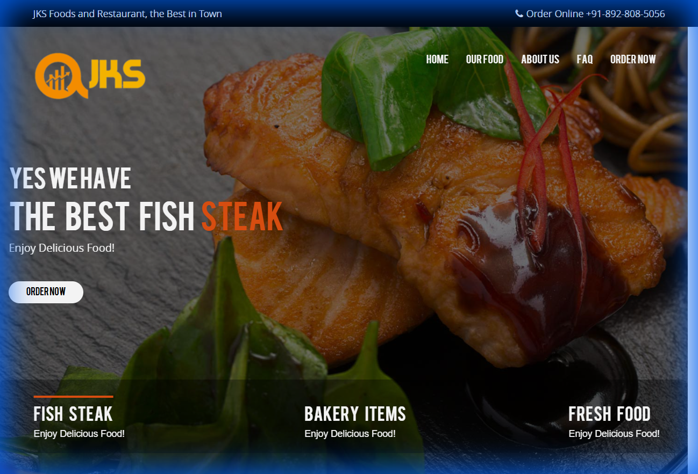

# 🍔 Online Food Ordering Website

## 📝 Project Overview
This is a comprehensive frontend template for an **Online Food Ordering** website. It provides a polished, responsive user interface for displaying menus, food categories, restaurant locations, and managing user accounts. It is designed to be easily deployed to static hosting services like GitHub Pages or Firebase.

## ✨ Key Features
*   **Responsive Design**: Optimized for desktop, tablet, and mobile devices.
*   **Rich UI Components**: Includes carousels, food grids, and styled forms.
*   **Multi-Page Navigation**:
    *   **Home**: Feature highlights and promotions (`index.html`, `index2.html`).
    *   **Menu**: Detailed food listings (`menu.html`, `food.html`).
    *   **Gallery**: Visual showcase of dishes (`gallery.html`).
    *   **Blog**: Food articles and news (`blog.html`).
    *   **Locations**: Restaurant locator (`location.html`).
*   **User Account**: Profiles and settings pages (`account/`).

## 🖼️ Screenshots


## 📂 Folder Structure
```text
.
├── 📂 account/         # User account related pages
├── 📂 css/             # Stylesheets
├── 📂 fonts/           # Web fonts
├── 📂 images/          # Website assets
├── 📂 js/              # JavaScript files
├── 📂 public/          # Public assets
├── 📂 screenshots/     # Additional project screenshots
├── 📄 index.html       # Main landing page
├── 📄 menu.html        # Menu page
├── 📄 food.html        # Food category page
├── 📄 order.html       # Order placement page
├── 📄 package.json     # Project dependencies (yarn/deployment)
└── 📄 README.md        # Project documentation
```

## 🛠️ Prerequisites & Setup
This project is primarily a **Static Website** (HTML/CSS/JS).

### Running Locally
1.  **Simply Open Files**: You can double-click `index.html` to view the website in your browser.
2.  **Live Server (Recommended)**: For the best experience (loading fonts/animations correctly), use a local server like VS Code's "Live Server" extension.

### Dependencies
If you wish to use the included build/deployment scripts:
*   **Node.js & Yarn**
*   Install dependencies:
    ```bash
    yarn install
    ```

## 🚀 Deployment
The project includes configuration for deployment:
*   **GitHub Pages**: `yarn run deploy` (requires `gh-pages` package).
*   **Firebase**: Contains `firebase.json` for Firebase Hosting.

## 💻 Tech Stack
*   **Frontend**: HTML5, CSS3, JavaScript
*   **Package Manager**: Yarn
