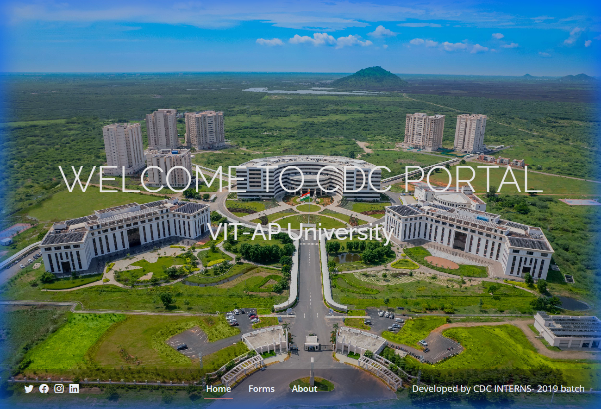

# 🎓 CDC Portal - VIT-AP University

## 📝 Project Overview
This website serves as the **Career Development Centre (CDC) Portal** for **VIT-AP University**. Its primary purpose is to streamline the collection of career-related data from graduating students, categorizing them into Placements, Higher Education, or Public/Private Sector careers.

## ✨ Key Features
*   **Data Collection Hub**: Centralized links to Google Forms for student data submission.
*   **Information Dissemination**: Provides guidelines and categories for data entry.
*   **Recruiter Showcase**: Highlights top recruiters and placement statistics.
*   **About CDC**: Information about the placement cell's role and achievements.

## 🖼️ Screenshots


## 📂 Folder Structure
```text
.
├── 📂 assets/
│   ├── 📂 css/         # Stylesheets
│   ├── 📂 img/         # Images (University logos, Clients)
│   ├── 📂 vendor/      # External libraries
│   └── 📂 js/          # JavaScript files
├── 📂 report/          # Report data or assets
├── 📄 index.html       # Main landing page
└── 📄 README.md        # Project documentation
```

## 🛠️ Prerequisites & Setup
This is a **Static Website**.
1.  **Run Locally**
    Simply open the `index.html` file in any modern web browser.

## 🤝 Credits
**Developed by CDC INTERNS - 2019 Batch**:
*   **Kota Karthik Kumar Reddy**
*   **T.CH.Phaniswar Reddy**
*   **Katuri Venkatesh**
*   **Kommuri Likhita**
