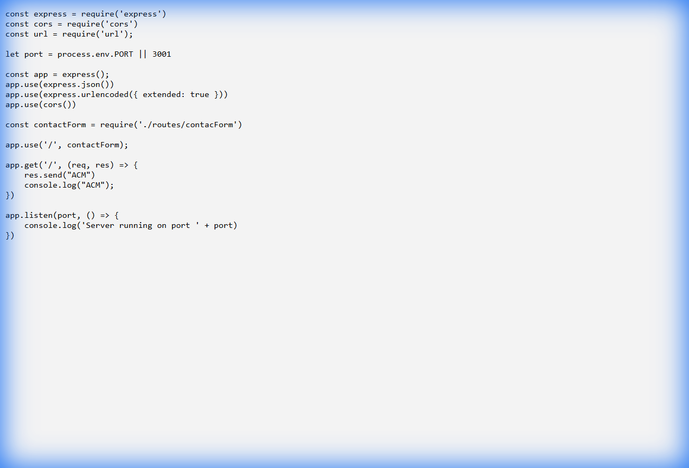

# ⚙️ ACM Deploy Server

## 📝 Project Overview
This project serves as the **Backend API** for the ACM Student Chapter. It is a **Node.js** and **Express** application designed to handle server-side logic, specifically communicating with the frontend for contact form submissions and sending emails via **Nodemailer**.

## ✨ Key Features
*   **Express Server**: Lightweight web server logic.
*   **Email Handling**: Uses `nodemailer` to send emails (e.g., from a "Contact Us" form).
*   **CORS Support**: Enbaled Cross-Origin Resource Sharing for frontend client communication.
*   **Routing**: Dedicated routes for contact forms.

## 🖼️ Screenshots

*(Note: This is a backend service with no graphical user interface)*

## 📂 Folder Structure
```text
.
├── 📂 node_modules/    # Dependencies
├── 📂 routes/          # API Route definitions
├── 📄 index.js         # Main server entry point
├── 📄 package.json     # Project dependencies
├── 📄 Procfile         # Heroku deployment configuration
└── 📄 README.md        # Project documentation
```

## 🛠️ Prerequisites & Setup
Ensure **Node.js** is installed.

1.  **Install Dependencies**
    ```bash
    npm install
    ```

2.  **Run Locally**
    ```bash
    npm start
    ```
    The server typically runs on port 3001 (or as defined in environment variables).

3.  **Environment Variables**
    You may need to configure environment variables for email credentials (e.g., in a `.env` file, though not present by default).

## 💻 Tech Stack
*   **Runtime**: Node.js
*   **Framework**: Express.js
*   **Utilities**: Nodemailer, Body-parser, Cors
