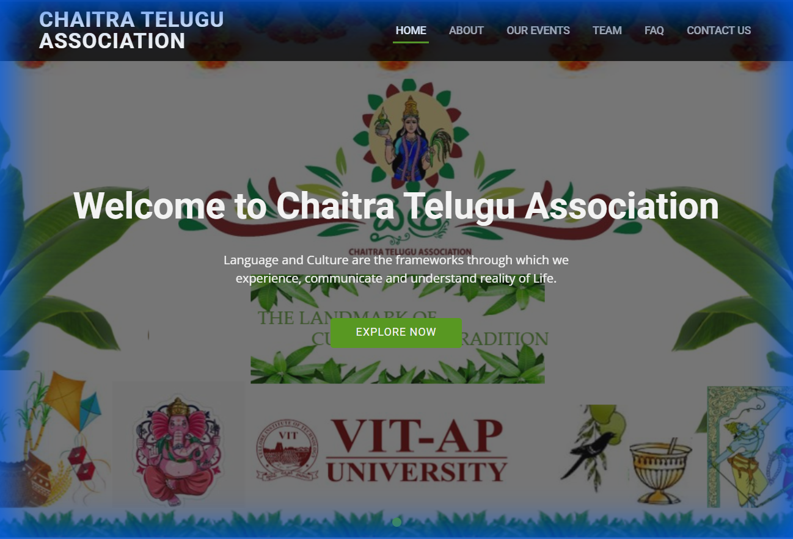

# 🪔 Chaitra Telugu Association (Main)

## 📝 Project Overview
This repository contains the source code for the **Chaitra Telugu Association** website. It is designed to showcase the diverse cultural events and activities of the Telugu community at **VIT-AP University**.

## ✨ Key Features
*   **Cultural Hub**: Information about Telugu traditions and festivals.
*   **Event Gallery**: Visual Highlights of Rangoli competitions and cultural fests.
*   **Detailed Team Page**: Hierarchical display of the association's core committee.
*   **FAQ Section**: Accordion-style Frequently Asked Questions.

## 🖼️ Screenshots


## 📂 Folder Structure
```text
.
├── 📂 assets/
│   ├── 📂 css/         # Custom CSS
│   ├── 📂 img/         # Images
│   ├── 📂 vendor/      # Plug-ins
│   └── 📂 js/          # Main JavaScript
├── 📄 index.html       # Homepage
└── 📄 README.md        # Project documentation
```

## 🛠️ Prerequisites & Setup
This is a **Static Website**.
1.  **Usage**: Clone repository and open `index.html` in your browser.

## 🤝 Credits
Designed and Developed by:
*   **Karthik Kumar Reddy Kota**
*   **Tunuguntla Sindhu Gayathri**
