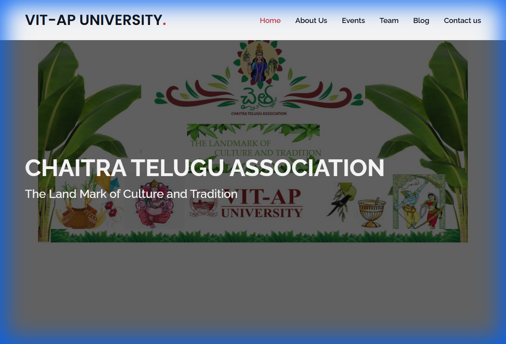

# 🪔 Chaitra Telugu Association Website

## 📝 Project Overview
This website serves as the official digital presence for the **Chaitra Telugu Association** at **VIT-AP University**. It highlights the culture, traditions, and events organized by the association to promote Telugu heritage on campus.

## ✨ Key Features
*   **Hero Section**: Introduces the association's mission.
*   **Event Showcase**: Carousels and video embeds displaying past events.
*   **Team Section**: Profiles of student coordinators and leadership.
*   **Contact Form**: Functional form for inquiries.
*   **Responsive Layout**: Built with **Bootstrap** for mobile compatibility.

## 🖼️ Screenshots


## 📂 Folder Structure
```text
.
├── 📂 assets/
│   ├── 📂 css/         # Custom Styles
│   ├── 📂 img/         # Images (Team, Portfolio, Logos)
│   ├── 📂 js/          # Custom Scripts
│   └── 📂 vendor/      # Third-party libraries (Bootstrap, AOS, etc.)
├── 📄 index.html       # Main landing page
└── 📄 README.md        # Project documentation
```

## 🛠️ Prerequisites & Setup
This is a **Static Website**.
1.  **Clone the Repository**
    ```bash
    git clone https://github.com/chaitra/chaitra.github.io.git
    ```
2.  **Run Locally**
     simply open `index.html` in your web browser.

## 💻 Tech Stack
*   **Frontend**: HTML5, CSS3, JavaScript
*   **Framework**: Bootstrap
*   **Libraries**: AOS (Animate On Scroll), Swiper.js, GLightbox

## 🤝 Credits
Designed by:
*   **Karthik Kumar Reddy Kota**
*   **Tunuguntla Sindhu Gayathri**
